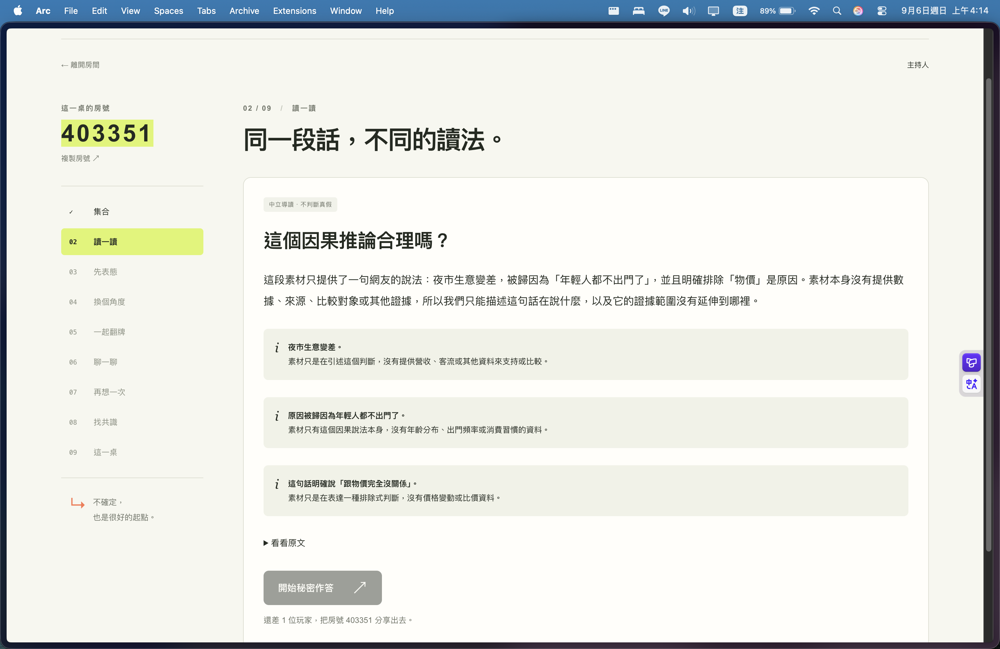
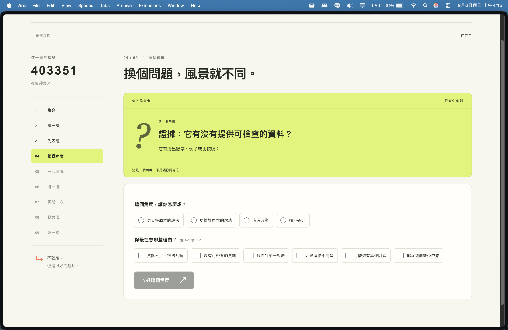
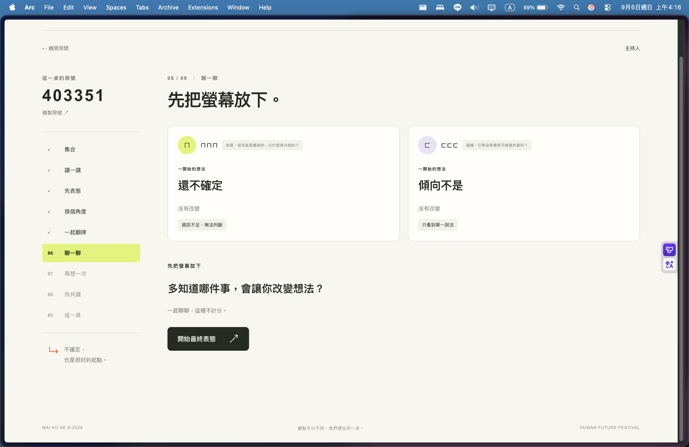
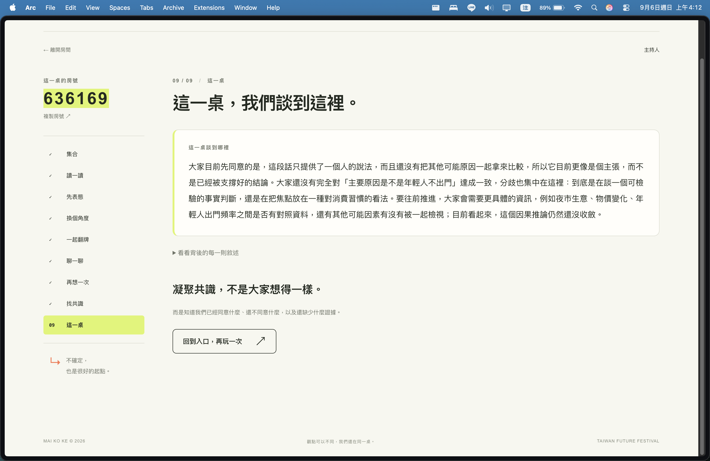

# 《麥擱假》 Māi koh ké

> 不用想得一樣，但可以多想一點。<br>
> You don’t have to agree. Just bring a reason.

把一則有爭議的貼文，變成一桌人能一起參與的思辨遊戲。AI 協助導讀與整理，不替大家決定誰對誰錯。<br>
An AI-facilitated discussion game: think independently, explore another angle, and understand disagreement without asking AI to pick a winner.

**[觀看展示影片 / Watch demo video](https://youtu.be/r44S7jpL2tc)** · **[線上體驗 / Live demo](https://mai-ko-ke.vercel.app)** · [MIT 授權 / License](./LICENSE) · [第三方揭露 / Third-party disclosure](./THIRD_PARTY_NOTICES.md)

**完整體驗需要 1 位主持人＋至少 2 位玩家。主持人不投票。** 建議三人各用自己的裝置；一人試玩請使用三個獨立的瀏覽器身分。同一瀏覽器的兩個分頁不是兩位玩家，無痕視窗也可能共用身分，請使用不同瀏覽器或獨立使用者設定檔。

**A full round needs one host and at least two players. The host does not vote.** Use separate devices or three isolated browser profiles. Tabs—and sometimes incognito windows—share cookies and therefore identity.

## 問題與摘要 / Problem and summary

網路討論容易讓人急著站隊，卻很少說清楚判斷背後的理由。《麥擱假》把一則有爭議的內容變成同場朋友的思辨遊戲：玩家先秘密表態，再收到不同角度的思考卡，完成後一起翻牌、面對面討論，最後確認一張保留共識、分歧與資訊缺口的地圖。AI 負責白話導讀與整理觀點，不判定真假或替玩家打分。支援中英文與手機操作，讓不熟悉議題的人也能參與。

Online discussions often reward taking sides before explaining reasons. A host shares a post; players answer privately, receive perspective cards, reveal their responses together, and discuss face to face. The final summary preserves agreement, disagreement, and missing information. The interface supports Chinese, English, and mobile devices.

## 畫面預覽 / Screenshots

以下為實際操作截圖；房號是當時的示例，體驗時請另開新房間。 / Screenshots from actual sessions; the displayed room codes are examples, not permanent demo rooms.

### 中立導讀 / Neutral briefing

先讀懂素材的主張與證據範圍，不急著判定真假。 / Understand the claims and evidence boundaries before taking a position.



### 換個角度 / Perspective card

每位玩家閱讀自己的思考卡，再選擇想法的變化與在意的理由。 / Players consider their perspective cards and explain how their thinking changes.



### 面對面討論 / In-person discussion

翻牌後看見彼此的立場與理由，把焦點轉回現場對話。 / Reveal positions and reasons, then discuss face to face.



### 這一桌的共識與分歧 / Agreement and disagreement

留下討論摘要，保留尚未收斂的分歧與需要補充的資訊。 / Capture the discussion while preserving disagreement and missing information.



## 怎麼體驗 / Try it

**黑客松展示用開房通行碼 / Public hackathon host passcode：`mkk-407e9731e2f4`**

此通行碼經團隊同意公開，供評審與參與者體驗。玩家加入只需房號，不需此通行碼。活動結束後須移除此公開說明，並更換部署環境的 `MKK_HOST_KEY`；只刪除文件不會移除 Git 歷史中的舊值。<br>
Published with the team's approval for hackathon reviewers and participants. Players only need the room code. After the event, remove this notice and rotate the deployed `MKK_HOST_KEY`; deleting the text alone does not remove the old value from Git history.

1. 主持人開啟[網站](https://mai-ko-ke.vercel.app)，選「我來開房」，輸入上方展示通行碼，開房後分享六位數房號。<br>
   The host opens the website, selects “Host a room,” enters the demo passcode above, and shares the resulting six-digit room code.
2. 至少兩位玩家選「加入朋友」，輸入房號與暱稱。<br>
   At least two players join with the code and their nicknames.
3. 主持人選「填入示範素材」，或貼上自己的素材，再按「產生中立導讀」。<br>
   The host loads sample material or pastes a post, then generates a briefing.
4. 跟著下方流程完成一輪；主持人依畫面提示推進，玩家在自己的裝置上作答。<br>
   Follow the stages below. The host guides the session; players answer on their own devices.

### 一輪遊戲 / A complete round

| 階段 / Stage | 畫面與操作 / What happens |
|---|---|
| 01 集合 / Gather | 主持人開房、玩家入座、貼上討論素材。 / Create a room, join, and choose material. |
| 02 讀一讀 / Read | 閱讀中立導讀，分清楚素材說了什麼、又沒有提供哪些證據。 / Read the claims and their evidence boundaries. |
| 03 先表態 / First position | 玩家秘密選擇初始立場，不先看別人的答案。 / Choose a position privately. |
| 04 換個角度 / Another angle | 閱讀自己的思考卡，選擇想法是否改變，以及在意的理由。 / Consider a perspective card and explain its effect. |
| 05 一起翻牌 / Reveal | 作答完成後，一起看彼此的立場與理由。 / Reveal responses together after the required players finish. |
| 06 聊一聊 / Discuss | 放下螢幕，面對面問「你為什麼這樣想？」 / Discuss the reasoning face to face. |
| 07 再想一次 / Reconsider | 討論後再次秘密表態。 / Submit a final private response. |
| 08 找共識 / Review | AI 起草敘述，由玩家逐則表態，不由 AI 自行認定共識。 / Players vote on AI-drafted statements. |
| 09 這一桌 / Wrap up | 查看共識、分歧與資訊缺口，留下這一桌的討論摘要。 / Review agreement, disagreement, and information gaps. |

## 本機啟動 / Run locally

準備 Git、Node.js 24.x、npm 11.x 與現代瀏覽器；本機曾以 Node 24.12.0、npm 11.6.2 驗證。<br>
Prerequisites: Git, Node.js 24.x, npm 11.x, and a modern browser. Locally verified with Node 24.12.0 and npm 11.6.2.

```bash
git clone https://github.com/KennyLuo0401/mai-ko-ke.git
cd mai-ko-ke
npm ci
cp .env.example .env.local
npm run dev
```

開啟 http://localhost:3001，再依上方方式建立房間與加入。<br>
Open http://localhost:3001 and follow the play instructions above.

**預設是固定示範模式，不需 API 金鑰。** `MKK_STORE=memory`、`MKK_ANALYSIS_ADAPTER=fixture` 可在安裝依賴後作為離線展示備援，但任何輸入都會得到同一份固定分析，不代表即時 AI 分析。要分析自行貼上的素材，請使用下方的 `openai` 設定。

**The default is a fixed demo, not live AI analysis.** Memory storage and the fixture adapter need no API credentials and work offline after dependencies are installed. Every input receives the same analysis package; use the OpenAI adapter for live analysis.

## 技術架構 / Architecture

使用 Next.js 16 App Router、React、TypeScript；房間 API、狀態控制與 AI 呼叫在伺服器端執行，正式部署可使用 Supabase Postgres 儲存房間。<br>
Built with Next.js 16 App Router, React, and TypeScript. Room APIs, state transitions, and AI calls run server-side; Supabase Postgres provides persistent storage.

```text
主持人 / Host ─┐
              ├── Next.js App Router
玩家 / Players ┘        ├── app/api/           房間 API / Room APIs
                       ├── lib/contracts/     共用介面 / Shared contracts
                       ├── lib/game/          狀態機與規則 / State machine and rules
                       ├── lib/server/        儲存與權限 / Storage and access control
                       └── lib/ai/            導讀與共識草稿 / Briefings and consensus drafts
```

### 三個設計原則 / Three design boundaries

- **AI 協助思考，不擔任裁判。** 產生導讀、證據範圍、思考卡與共識候選敘述；共識分類由 `lib/game/rules.ts` 根據玩家投票計算。<br>
  AI facilitates rather than judges. Player votes, not model approval, determine statement placement.
- **流程由程式決定。** `lib/game/machine.ts` 定義合法狀態轉換；翻牌須等必要玩家完成，前端按鈕不是權限依據。<br>
  Code controls legal transitions and reveal readiness; the server is authoritative.
- **秘密作答由伺服器保護。** `getRoomView()` 依角色過濾資料；翻牌前只回傳自己的答案與思考卡，主持人也不能偷看。<br>
  Role-filtered server responses protect private answers and cards before reveal, including from the host.

### AI 模式 / AI adapters

以 `MKK_ANALYSIS_ADAPTER` 切換：<br>
Select the adapter with `MKK_ANALYSIS_ADAPTER`:

| 設定 / Value | 行為 / Behavior |
|---|---|
| `fixture`（預設 / default） | 固定雙語資料，不呼叫模型；任何輸入得到同一份分析。 / Deterministic bilingual data; identical analysis for every input. |
| `openai` | 使用 Responses API 與 Structured Outputs；需設定 `OPENAI_API_KEY`、`OPENAI_MODEL`。 / Live analysis using the configured API key and model. |

輸出須通過 `lib/ai/schemas.ts` 驗證；模型呼叫最多嘗試三次並採指數退避，失敗會顯示錯誤，不把不合格式的結果送入遊戲。<br>
Outputs must pass versioned schemas. Calls use up to three attempts with exponential backoff; invalid output produces a visible failure.

### 儲存與部署 / Storage and deployment

- `MKK_STORE=memory`：適合本機與測試，重啟就會失去房間，不能跨伺服器實例共用。<br>
  Local/test storage only; rooms disappear on restart and are not shared across instances.
- `MKK_STORE=supabase`：部署前依序套用 `supabase/migrations/`，並設定 [.env.example](./.env.example) 中的 Supabase 變數。<br>
  Apply the database migrations in order and configure the Supabase environment variables before deployment.
- 正式環境必須設定獨立的 `MKK_SESSION_SECRET`，不可使用範本值；`MKK_HOST_KEY` 可限制誰能開房。所有真實金鑰只放環境變數，不提交 Git。<br>
  Use a unique production session secret. An optional host passcode restricts room creation. Never commit real credentials.

## 驗證與限制 / Verification and limitations

| 指令 / Command | 用途 / Purpose |
|---|---|
| `npm run dev` | 本機開發，port 3001 / Local development |
| `npm run build` | 正式建置 / Production build |
| `npm run lint` / `npm run typecheck` | 程式規範與型別檢查 / Lint and type checks |
| `npm test` | 遊戲規則、狀態機、schema 與儲存測試 / Rules, state machine, schema, and store tests |
| `npm run test:e2e` | 主持人＋兩位玩家的桌機／手機流程 / Desktop and mobile browser flows |
| `npm run smoke` | 對已啟動伺服器執行完整 HTTP 流程 / HTTP smoke test against a running server |
| `npm run verify` | lint、型別、單元測試與建置 / Lint, types, unit tests, and build |

瀏覽器測試需先執行 `npx playwright install chromium`。E2E 設定在本機會重用已啟動的開發伺服器，不需另開第二個。<br>
Install Chromium once for browser tests. The local E2E configuration reuses an existing development server.

真實 OpenAI／Supabase 測試在缺少憑證時會跳過，不等於已驗證線上服務。**Supabase 流程測試會清除房間資料，只能對獨立測試資料庫執行，不可使用正式資料庫。**<br>
Live-service tests skip without credentials; that is not production verification. **The Supabase flow suite resets room data: use a disposable test database, never production.**

這是協助討論的工具，不是事實查核或裁決服務。固定示範模式、多人身分隔離與記憶體儲存限制請見上方；實際驗證紀錄與其餘限制見 [PROJECT_STATUS.md](./PROJECT_STATUS.md)。<br>
This is a discussion tool, not a fact-checking or adjudication service. See the project status for verification history and remaining limitations.

## 開發文件與授權 / Development documents and license

- [BUILD_PLAN.md](./BUILD_PLAN.md)：功能範圍與開發規劃 / Scope and roadmap
- [PROJECT_STATUS.md](./PROJECT_STATUS.md)：實際成果、測試紀錄與限制 / Implementation status, tests, and limitations
- [SESSION_PROMPT.md](./SESSION_PROMPT.md)：開發工作檢查表 / Development session checklist
- [SUBMISSION.md](./SUBMISSION.md)：黑客松繳交檢查與待辦 / Submission checklist and pending items
- [THIRD_PARTY_NOTICES.md](./THIRD_PARTY_NOTICES.md)：第三方套件、模型與素材揭露 / Third-party disclosure
- [LICENSE](./LICENSE)：MIT 授權 / MIT license
